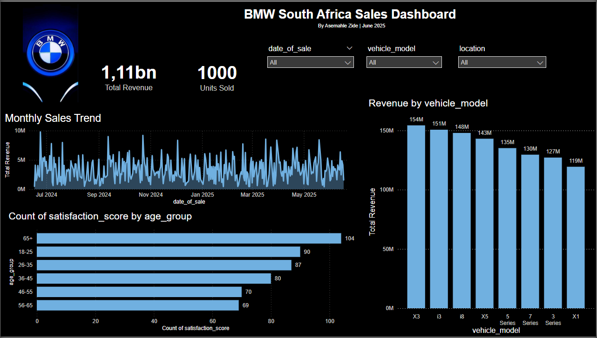
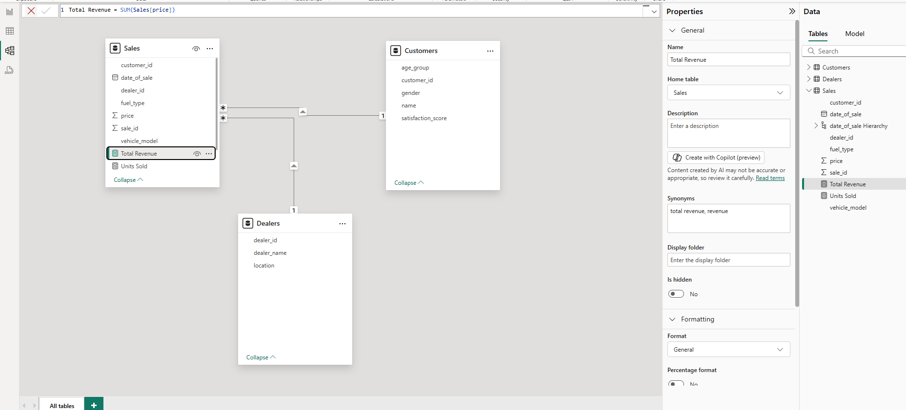

# 🚗 BMW South Africa Sales Dashboard

📊 **Power BI Dashboard Project**  
👤 By **Asemahle Zide** | 🗓️ **June 2025**

This dashboard presents an interactive analysis of BMW's sales performance across South Africa from July 2024 to June 2025. The report is built to uncover insights across customer demographics, vehicle performance, and regional sales trends.

---

## 📌 Project Objectives

- Track **monthly revenue trends** across a 12-month sales cycle.
- Segment **customer satisfaction** by age group.
- Visualize **total revenue by vehicle model** (e.g., i3, X3, 3 Series).
- Highlight **regional performance** across provinces like KwaZulu-Natal, Western Cape, and Eastern Cape.

---

## 📊 Dashboard Highlights

- 🧮 **KPI Cards**:  
  - **Total Revenue**: R1.11 Billion.  
  - **Units Sold**: 1,000 vehicles.

- 📈 **Monthly Sales Trend**  
  - Time-series analysis of revenue from Jul 2024 to May 2025

- 👥 **Customer Satisfaction Analysis**  
  - Segmented by age groups (e.g., 18–25, 26–35, 65+)

- 🚙 **Revenue by Vehicle Model**  
  - Highest earners include **X3, i3, i8, and X5**

- 🌍 **Sales by Province**  
  - Detailed breakdown by location and vehicle type

---

## 🛠️ Tools & Technologies

| Tool        | Usage                              |
|-------------|-------------------------------------|
| Power BI    | Data modeling, visual design, DAX   |
| Excel       | Source data transformation          |
| DAX         | Custom measures and aggregations    |

---

## 🖼️ Screenshots

### 🔹 Dashboard Overview

### 🔹 PowerBI_model_view_DAX

---

## 📂 Repository Contents

| File Name                            | Description                         |
|-------------------------------------|-------------------------------------|
| `BMW_SA_Sales_Dashboard.pbix`       | Power BI dashboard project file     |
| `overview.png`                      | Main dashboard screenshot           |
| `PowerBI_model_view_DAX.png`        | VisualisationChart                  |

---

## 📎 How to Use

1. Clone this repo or download files.
2. Open the `.pbix` file using **Power BI Desktop**.
3. Explore and interact with the visuals and filters.

------

## 💼 About Me 
🔗 [Connect with me on LinkedIn](https://www.linkedin.com/in/asemahle-zide-201063215/)

